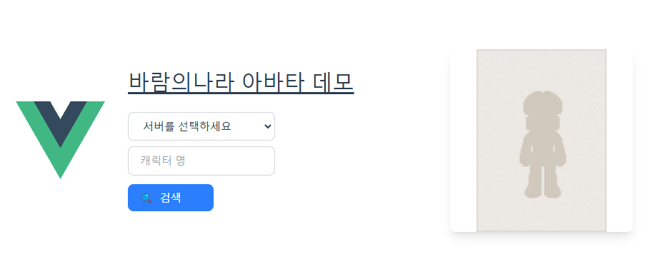

# 🤴아바타 모듈

바람의나라 Open Api와 RenderAvatar를 활용한 아바타 생성 모듈

## 📑사용법

서버와 캐릭터명을 입력 후 검색을 하면 자동으로 해당 캐릭터의 아바타를 렌더링하여 가져옴.

## 🧪개발 예정

1. 의상실의 아이템 리스트를 크롤링하여 아바타를 꾸밀 수 있도록 제공.
2. 직접 아이템명을 기입하여 착용.

## 🎭아바타 모듈 데모

### [데모 페이지](https://bardstale.github.io/avatar-module/ "아바타 모듈 깃헙 페이지")